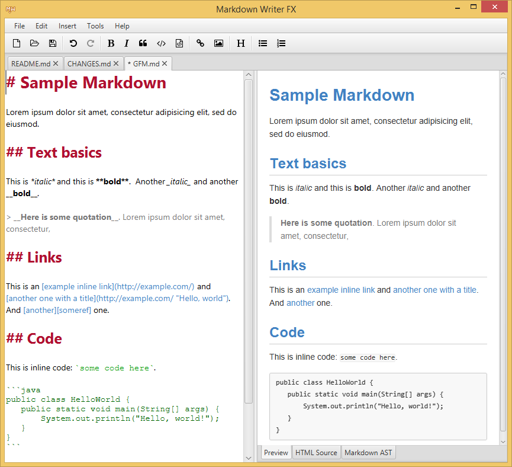

Markdown Writer FX
==================

An open source [Markdown] editor written in JavaFX 8.



For Markdown processing it uses [commonmark-java], a Java implementation of [CommonMark].

Features
--------

  * Syntax highlighting in editor
  * Keyboard shortcuts to insert Markdown (Bold, Italic, Code, Links, Images, Header, Lists, ...)
  * Auto-indent lists
  * HTML preview
  * HTML source preview
  * Markdown AST view
  * Multi-platform: Windows, Mac, Linux, ...

TODO
----

  * auto-complete
  * search and replace
  * improved syntax highlighting (HTML, ...)
  * more options
  * directory tree view
  * spell checker
  * support [Kirby CMS](http://getkirby.com/) content files and tags
  * TBD

Requirements
------------

Java 8u40 or later is required.

Installation
------------

Download
[markdown-writer-fx-0.2.zip](https://github.com/JFormDesigner/markdown-writer-fx/releases/download/0.2/markdown-writer-fx-0.2.zip)
and extract it to any folder.

Double-click `markdown-writer-fx.jar` to start *Markdown Writer FX*.

If this does not work, try following command in a terminal window:

```
java -jar markdown-writer-fx.jar
```

Changes
-------

See [Change Log](CHANGES.md)

Credits
-------

  * Tomas Mikula for [RichTextFX], [ReactFX], [WellBehavedFX], [Flowless] and [UndoFX]
  * Mikael Grev for [MigLayout] and Tom Eugelink for MigPane
  * Atlassian for [commonmark-java] Markdown parser
  * Jens Deters for [FontAwesomeFX]

License
-------

*Markdown Writer FX* is open source licensed under the [BSD 2-Clause License](LICENSE)

   [Markdown]: http://daringfireball.net/projects/markdown/
   [CommonMark]: http://commonmark.org/
   [commonmark-java]: https://github.com/atlassian/commonmark-java
   [Markdown Extra]: https://michelf.ca/projects/php-markdown/extra/
   [MultiMarkdown]: http://fletcherpenney.net/multimarkdown/
   [Github-flavoured-Markdown]: https://help.github.com/articles/github-flavored-markdown/
   [MigLayout]: https://github.com/mikaelgrev/miglayout
   [RichTextFX]: https://github.com/TomasMikula/RichTextFX
   [ReactFX]: https://github.com/TomasMikula/ReactFX
   [WellBehavedFX]: https://github.com/TomasMikula/WellBehavedFX
   [Flowless]: https://github.com/TomasMikula/Flowless
   [UndoFX]: https://github.com/TomasMikula/UndoFX
   [FontAwesomeFX]: https://bitbucket.org/Jerady/fontawesomefx
