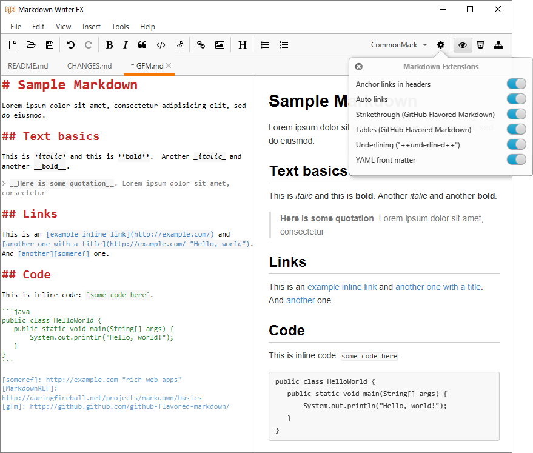

Markdown Writer FX
==================

An open source [Markdown] editor written in JavaFX 8.

For Markdown rendering it uses [commonmark-java] or [flexmark-java],
two Java implementations of the [CommonMark] specification.

Features
--------

  * Syntax highlighting in editor
  * Keyboard shortcuts to insert Markdown (Bold, Italic, Code, Links, Images, Header, Lists, ...)
  * Auto-indent lists
  * Search and replace
  * Project manager
  * HTML preview
  * HTML source preview
  * Markdown AST view
  * Multi-platform: Windows, Mac, Linux, ...

Requirements
------------

Java 8u40 or later is required.
Java 8u131 or later is recommended.
Java 9 is not supported. Coming soon.

Installation
------------

Download
[markdown-writer-fx-0.11.zip](https://github.com/JFormDesigner/markdown-writer-fx/releases/download/0.11/markdown-writer-fx-0.11.zip)
and extract it to any folder.

Run: 
 - for Windows, `bin/markdown-writer-fx.bat` to start *Markdown Writer FX*
 - and for Unix systems `./bin/markdown-writer-fx.sh` to start *Markdown Writer FX*

from the project folder.

Building
-------
Prerequisites are git and Java 8 in order to build *Markdown Writer FX* form sources.

 - get the source, e.g. by cloning the official repo with: 
   `git clone https://github.com/JFormDesigner/markdown-writer-fx.git`
 - run `./gradlew assembleDist` to create the distribution in the
   `$project/build/distributions/` folder.

Changes
-------

See [Change Log](CHANGES.md)

Credits
-------

  * Tomas Mikula for [RichTextFX], [ReactFX], [WellBehavedFX], [Flowless] and [UndoFX]
  * Mikael Grev for [MigLayout] and Tom Eugelink for MigPane
  * Vladimir Schneider for [flexmark-java] Markdown parser
  * Atlassian for [commonmark-java] Markdown parser
  * Jens Deters for [FontAwesomeFX]
  * The [ControlsFX] project
  * Matthieu Brouillard for [CSSFX]
  * Lea Verou, Golmote & more for [Prism]

License
-------

*Markdown Writer FX* is open source licensed under the [BSD 2-Clause License](LICENSE)

   [Markdown]: http://daringfireball.net/projects/markdown/
   [CommonMark]: http://commonmark.org/
   [commonmark-java]: https://github.com/atlassian/commonmark-java
   [flexmark-java]: https://github.com/vsch/flexmark-java
   [Markdown Extra]: https://michelf.ca/projects/php-markdown/extra/
   [MultiMarkdown]: http://fletcherpenney.net/multimarkdown/
   [Github-flavoured-Markdown]: https://help.github.com/articles/github-flavored-markdown/
   [MigLayout]: https://github.com/mikaelgrev/miglayout
   [RichTextFX]: https://github.com/TomasMikula/RichTextFX
   [ReactFX]: https://github.com/TomasMikula/ReactFX
   [WellBehavedFX]: https://github.com/TomasMikula/WellBehavedFX
   [Flowless]: https://github.com/TomasMikula/Flowless
   [UndoFX]: https://github.com/TomasMikula/UndoFX
   [FontAwesomeFX]: https://bitbucket.org/Jerady/fontawesomefx
   [ControlsFX]: http://fxexperience.com/controlsfx/
   [CSSFX]: https://github.com/McFoggy/cssfx
   [Prism]: https://github.com/PrismJS/prism
